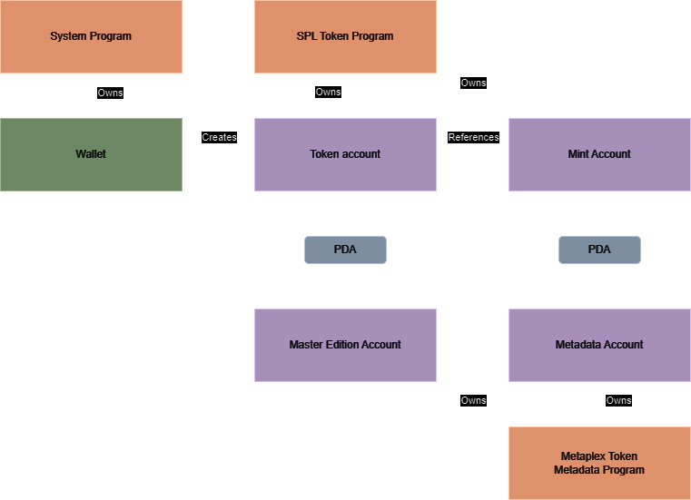

# Solana NFT Generator
This project, built with the Anchor framework, allows the user to deploy a smart contract on the Solana blockchain that creates and mints a customized NFT with Metaplex metadata.

## Table of Contents
- [Solana NFT Generator](#solana-nft-generator)
  - [Table of Contents](#table-of-contents)
  - [Architecture](#architecture)
  - [Technologies](#technologies)
  - [Features](#features)
  - [Getting Started](#getting-started)
    - [Prerequisites](#prerequisites)
    - [Installing](#installing)
  - [Build \& Deployment](#build--deployment)
    - [Development (localnet)](#development-localnet)
    - [Development (devnet)](#development-devnet)
    - [Production (mainnet)](#production-mainnet)
  - [Running Tests](#running-tests)
  - [Work-in-progress](#work-in-progress)
  - [Authors](#authors)
  - [License](#license)


## Architecture


## Technologies
- Solana
- Rust (Smart Contract)
- TypeScript (Tests)
- Anchor

## Features
- **Create and mint an NFT:** Deploy a smart contract that takes NFT metadata and create a beautiful NFT for yourself!
- **Customize your NFT:** Add metadata, such as title, symbol and image URI to customize your NFT!

## Getting Started
This step describes the prerequisites and install steps for the libraries needed to build and run the project.

### Prerequisites
- [Node.js 20+](https://nodejs.org/en)
- [Yarn](https://yarnpkg.com/getting-started/install)
- [Rust](https://www.rust-lang.org/tools/install)
- [Anchor](https://www.anchor-lang.com/docs/installation)

### Installing
First of all, you must clone this repository:
```sh
git clone https://github.com/andrewlod/solana-anchor-nft-practice.git
```

Then install all dependencies:
```sh
cd solana-anchor-nft-practice
yarn install
```

## Build & Deployment
### Development (localnet)
In order to build and deploy the application in your development environment with a Solana localnet, first run the Solana localnet in a second terminal:
```sh
solana-test-validator
```

It will standby and process transactions in your localnet. Then run the following commands:
```sh
# Generate the binary on-chain program
anchor build
# Deploy the program to your localnet
anchor deploy --provider.cluster localnet
```

### Development (devnet)
In order to build and deploy the application in your development environment with the Solana devnet, run the following commands:
```sh
# Generate the binary on-chain program
anchor build
# Deploy the program to your devnet
anchor deploy --provider.cluster devnet
```

### Production (mainnet)
In order to build and deploy the application in your development environment with the Solana devnet, run the following commands:
```sh
# Generate the binary on-chain program
anchor build
# Deploy the program to your devnet
anchor deploy --provider.cluster mainnet
```

## Running Tests
In order to build and test the application in your development environment with a Solana localnet, run the following commands:
```sh
# Generate the binary on-chain program
anchor build
# Run TypeScript tests
anchor test
```

## Work-in-progress
This section describes features that are either work-in-progress or will be implemented in the future. Features are sorted by priority.
- 🚧: Work-in-progress
- ❌: Not yet started

| Feature | Status |
|---------|--------|

## Authors
- Andre Wlodkovski - [@andrewlod](https://github.com/andrewlod)

## License
This project is licensed under the [MIT License](https://opensource.org/license/mit) - see the [LICENSE](LICENSE) file for details.
